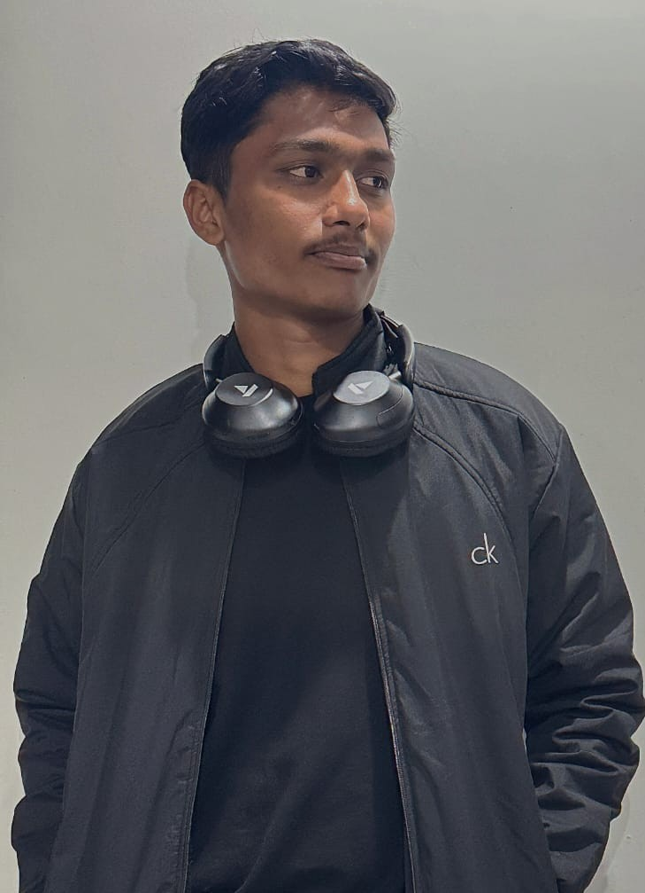

<html lang="en">
<head>
  <meta charset="utf-8" />
  <meta name="viewport" content="width=device-width,initial-scale=1" />
  <title>Vishwajeet Sunil Garad — Portfolio</title>

  <link href="https://fonts.googleapis.com/css2?family=Poppins:wght@300;400;600;700&display=swap" rel="stylesheet">

  
</head>
<body>

<header>
  

    

      
VG

      

        
Vishwajeet Sunil Garad

        
DTU • CSE ' 29

      

    

    <nav>
      <a href="#about">About</a>
      <a href="#skills">Skills</a>
      <a href="#interests">Interests</a>
      <a href="#projects">Projects</a>
      <a href="#contact">Contact</a>
    </nav>
  

</header>

<main class="hero" id="about">
  

  

    
Vishwajeet Sunil Garad

    
CSE Student • Delhi Technological University (DTU)

    

      Hi! I’m Vishwajeet from Dharashiv, Maharashtra. I completed my 10th from cbse school and studies of 11th and 12th had competed from Maharashtra board. I have intrest in both tech and non-tech fields. Passionate about Web Development, Intrested in ML, Speaking & Creativity.
        <strong>Mobile:</strong> 9975128499
        <strong>Email:</strong>vishwajeet.garad2007@gmail.com
    

    

      
Web Dev

      
Machine Learning

      
Creativity

    

  

</main>

<section class="card" id="skills">
  

    <h3>Skills </h3>
  

  
| C | Python | HTML | CSS | 

</section>

<section class="card" id="interests">
  

    <h3>Interests & Strengths</h3>
  

  

    
💻 Web Development

    
🤖 Machine Learning

    
⚙️ Technology Exploration

    
📝 Creative Writing

  

</section>

<section class="card" id="projects">
  

    <h3>Projects</h3>
  

  
I am working on my skills and I will fill this spot with various projects as soon as possible.

</section>

<section class="card" id="contact">
  

    <h3>Connect With Me</h3>
  

  

    

      

        Instagram:  
        <a href="https://www.instagram.com/vishu_2047_/" target="_blank">insta handle</a>
      

      

        LinkedIn:  
        <a href="https://www.linkedin.com/in/vishwajeet-garad-bb9244378/" target="_blank">linked in profile</a>
      

      

        Github:  
        <a href="https://github.com/vishu1047" target="_blank">github account</a>
      

      

        Mobile / WhatsApp:  
        <a href="tel:9975128499">9975128499</a>
      

      
      

    

  

</section>

<footer>
  © 2025 Vishwajeet Sunil Garad • Made with passion & creativity
</footer>

</body>
</html>
